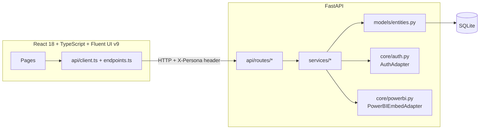

# Architecture

## Overview

OCIO Portal is a modular monolith prototype: a single FastAPI backend serving a
versioned REST API (`/api/v1`), and a single-page React frontend that consumes it.
There is no message bus, no microservices, and no external identity/BI providers in
this prototype — those integration points are isolated behind small adapter
interfaces so they can be swapped for production implementations later without
touching business logic or route handlers.

## Backend layering

- **`api/routes/*`** — thin FastAPI route handlers. They parse query/path params,
  call a single service function, and return the response model. No business logic
  lives here.
- **`services/*`** — one module per domain (workforce, applications, platforms,
  capabilities, assets, announcements, attestations, planner, analytics, dashboard,
  audit). All CRUD, coverage computation, RBAC checks (`require_role`), optimistic
  concurrency (`bump_version`), and audit logging (`record_audit`) happen here.
- **`services/common.py`** — shared helpers used by every service: pagination,
  audit event recording, version bumping, JSON helpers.
- **`models/entities.py`** — SQLAlchemy 2.x ORM models for all 21 entities, using
  `Mapped[...]` typed columns, `TimestampMixin`/`AuditUserMixin`/`VersionedMixin`.
- **`schemas/domain.py`** — Pydantic v2 request/response schemas, kept separate
  from ORM models so API contracts don't leak SQLAlchemy internals.
- **`core/auth.py`** — `AuthAdapter` protocol + `LocalDevAuthAdapter`, which resolves
  the caller's persona from the `X-Persona` header (defaulting to `executive`).
  Swappable for a real Entra ID adapter (see [enterprise-integration.md](./enterprise-integration.md)).
- **`core/powerbi.py`** — `PowerBIEmbedAdapter` protocol + `PlaceholderPowerBIAdapter`,
  which always returns `access_state="placeholder"` and a descriptive message instead
  of calling out to Power BI.

## Frontend layering

- **`api/client.ts`** — a thin `fetch` wrapper (`apiRequest<T>`) that always attaches
  the `X-Persona` header and surfaces failures as a typed `ApiError`.
- **`api/endpoints.ts`** — typed functions per domain, grouped the same way as the
  backend services.
- **`context/PersonaContext.tsx`** — holds the active persona (persisted to
  `localStorage`) and the list of available personas fetched from `/me/personas`.
- **`components/shell/AppShell.tsx`** — header, left nav, breadcrumb, and persona
  picker, wrapping every routed page via `<Outlet/>`.
- **`pages/*`** — one component per information-architecture section. Business
  logic (data fetching via TanStack Query, mutations, validation) lives in the page
  component; presentational pieces are extracted into `components/common/*`.

## Cross-cutting conventions

- **Error envelope**: every non-2xx response is shaped as `{ error, detail, code }`
  via FastAPI exception handlers in `app/main.py`.
- **Optimistic concurrency**: mutable entities carry an integer `version` column.
  Updates must submit the version they read; a mismatch raises `409 Conflict`
  (`bump_version()` in `services/common.py`).
- **RBAC**: every mutating service call passes the resolved persona through
  `require_role(user, *allowed_roles)`, raising `403 Forbidden` on failure.
- **Auditing**: every create/update/assign/review call writes an `AuditEvent` row via
  `record_audit()`, visible in the Administration page's audit trail table.

## Why a modular monolith (for this prototype)

A single deployable backend and single SPA keep the local developer loop fast (one
`npm run dev` starts both), while the adapter seams (`AuthAdapter`,
`PowerBIEmbedAdapter`) and the domain-oriented service/route split make it
straightforward to extract a domain into its own service later if scale requires it.
See [production-readiness.md](./production-readiness.md) for what else would change
before a real deployment.
