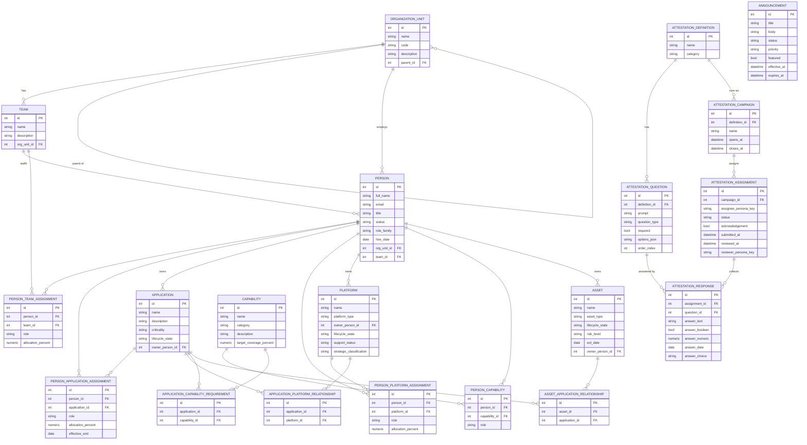

# Data Model

22 tables (21 domain entities + the `user_profiles` persona table) live in
`backend/app/models/entities.py`. All tables use integer surrogate primary keys and
NUMERIC(precision, scale) for decimals, so the schema can be ported to SQL Server /
Azure SQL with no structural changes.

Mutable domain entities share three mixins (`backend/app/models/mixins.py`):

- **`TimestampMixin`** — `created_at` / `updated_at` (timezone-aware).
- **`AuditUserMixin`** — `created_by_persona_key` / `updated_by_persona_key`.
- **`VersionedMixin`** — integer `version` column used for optimistic concurrency.

## Entity-relationship diagram

`AuditEvent` and `UserProfile` (personas) are intentionally omitted from the diagram
above — they aren't part of the core domain graph. `AuditEvent` is an
append-only log table (`entity_type`, `entity_id`, `action`, `actor_persona_key`,
`summary`, `created_at`) written by `services/common.py::record_audit()` on every
mutation. `UserProfile` seeds the 5 demo personas used by `LocalDevAuthAdapter`.

## Computed / derived fields

- `Capability.current_coverage` — not a column. Computed in
  `services/capabilities.py::_current_coverage()` from the ratio of people with a
  matching `PersonCapability` row vs. total headcount, and merged into the response
  via `SimpleNamespace` before Pydantic validation.
- `DashboardSummary.capability_coverage_percent` — average of all capabilities'
  computed coverage, in `services/dashboard.py`.
- Asset "approaching EOL" counts — computed on the fly from `Asset.eol_date` vs.
  `date.today() + N days`, both in `services/dashboard.py` (180-day KPI) and
  client-side in `AssetsPage.tsx` (90/180/365 day filters).

## Association ("relationship") entities

Six pure many-to-many association tables all share the same shape via
`_AssociationMixin` (`role`, `allocation_percent`, `effective_start`,
`effective_end`, plus the standard timestamp/audit/version mixins):
`PersonTeamAssignment`, `PersonApplicationAssignment`, `PersonPlatformAssignment`,
`PersonCapability`, `ApplicationPlatformRelationship`,
`ApplicationCapabilityRequirement`, `AssetApplicationRelationship` (7 total). This
uniform shape is what lets the Resource Planner's workforce/application/coverage
views compose person ↔ application ↔ platform ↔ capability data generically.
